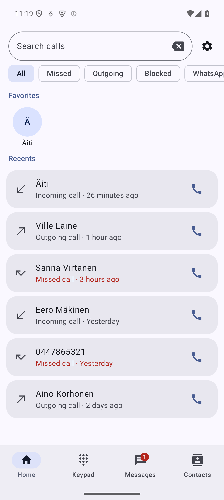
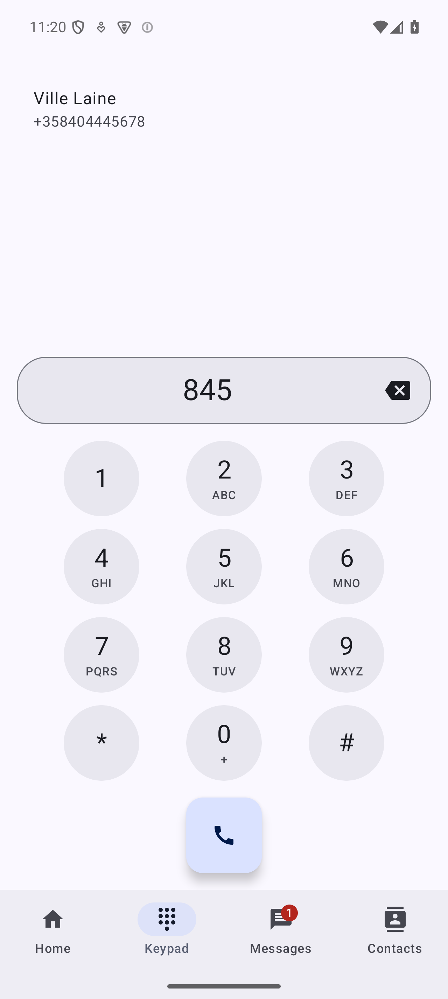
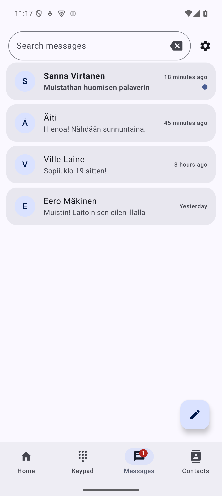
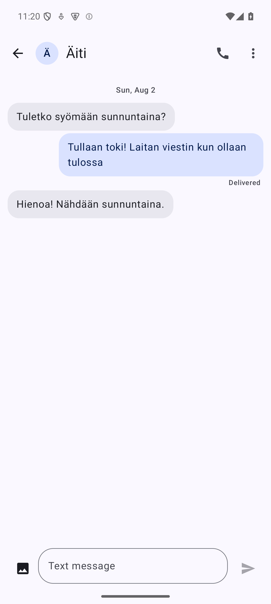

<p align="center">
  
</p>

<h1 align="center">ARK-phone</h1>

<p align="center">
  <a href="https://github.com/jrs8205/ARK-phone/releases/latest"></a>
  <a href="https://github.com/jrs8205/ARK-phone/releases"></a>
  <a href="LICENSE"></a>
</p>

<p align="center">
An Android dialer and messaging app that replaces your phone's default Phone and
Messages apps. Built with Kotlin, Jetpack Compose and Material 3.
</p>

**No internet permission.** ARK-phone never connects to the internet — calls and
messages go through your carrier, and nothing about you leaves the device.

## Screenshots

| Home | Keypad | Messages | Conversation |
|---|---|---|---|
|  |  |  |  |

## Features

### Calls

- Default phone app (dialer role) with a full in-call UI: mute, speaker, hold and
  a DTMF keypad; the screen turns off against your cheek and the app closes when
  the call ends
- Keypad with T9 search by name or number, speed dial and clipboard paste
- Recent calls with search, filter chips (missed / outgoing / blocked / WhatsApp)
  and grouping of repeated calls
- Contacts with favorites, most-called, search and a full contact card
  (numbers, emails, addresses, notes, WhatsApp/Telegram/Signal actions,
  vCard share); edits open the system editor and sync to your Google account
- Spoken caller announcement (TTS) and caller photo, including on the lock screen
- Missed-call notifications with call-back and message actions
- Call blocking: single numbers, hidden numbers, unknown callers, number
  prefixes, time-scheduled rules and per-SIM rules, plus an allow list,
  automatic favorites pass-through and repeat-caller pass-through; blocked
  calls can be rejected or routed silently to voicemail
- WhatsApp calls logged in call history with direct WhatsApp callback
- Dual-SIM support: default SIM selection, SIM shown per call, SIM info page

### Messages

- Default SMS app: send and receive SMS and picture messages (MMS),
  including group conversations
- Conversation list with search, unread indicators and a new-message flow
  with multi-recipient support
- Message notifications with quick reply and mark-as-read; blocked senders
  stay silent; opening a conversation clears its notifications
- Delivery status under sent messages and tap-to-retry for failed picture
  downloads
- Web links, email addresses and phone numbers in messages are tappable —
  tapping a number asks before calling
- Long-press selection: delete or share several messages at once; share text
  and pictures from other apps straight into ARK-phone

### Privacy

- No `INTERNET` permission — the app cannot phone home, show ads or track you
- No analytics, no crash reporting, no third-party SDKs talking to servers
- Your calls, messages and contacts stay in Android's own system stores

## Install

1. Download `app-release.apk` from the
   [latest release](https://github.com/jrs8205/ARK-phone/releases/latest).
2. Open the file on your phone and allow installing from unknown sources
   when asked.
3. Set ARK-phone as the default phone app, and optionally as the default
   SMS app, when the app offers it.

Requires Android 8.0 (API 26) or newer. Tested on Pixel and Samsung Galaxy
phones.

## Building

```
./gradlew :app:assembleDebug
```

The debug APK is written to `app/build/outputs/apk/debug/`.

## Testing

```
./gradlew :app:testDebugUnitTest :app:lintDebug
```

The suite has 600+ unit tests and lint runs with `warningsAsErrors`.

## Languages

English by default; Finnish is selected automatically from the device
language.

## License

GPL-3.0 — see [LICENSE](LICENSE).
