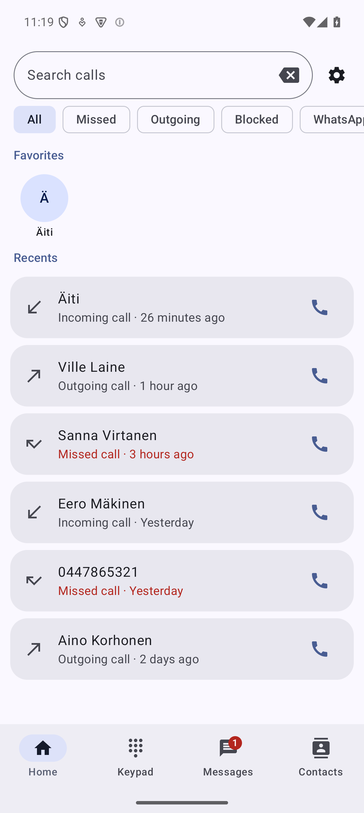
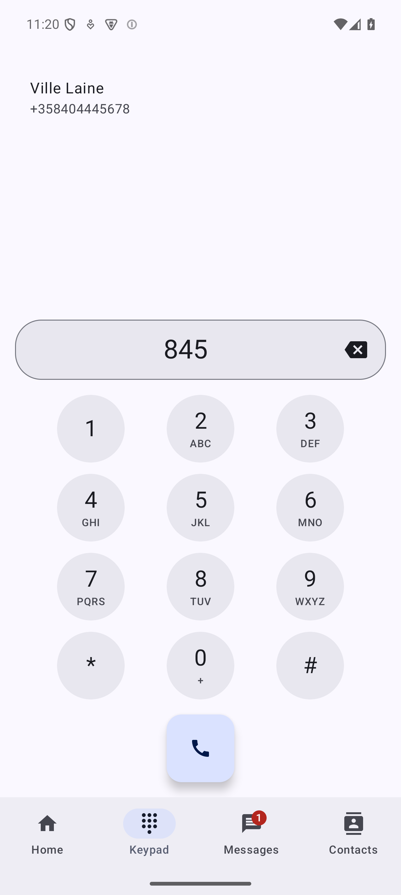
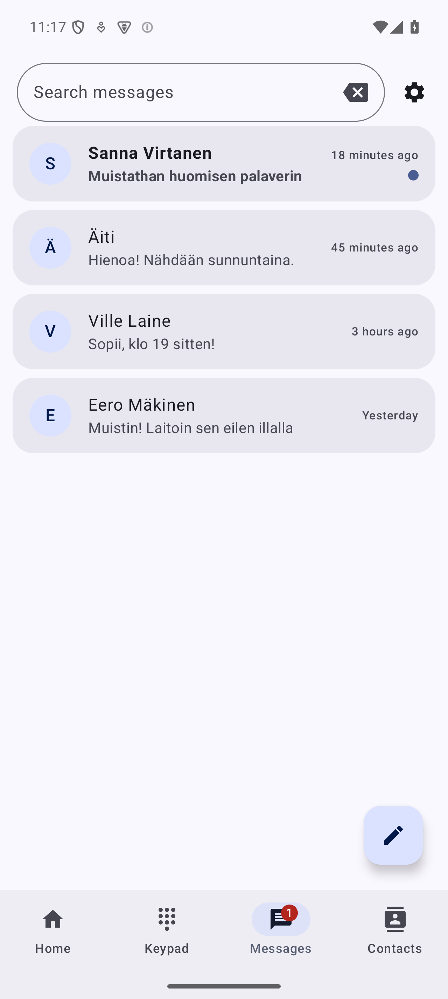
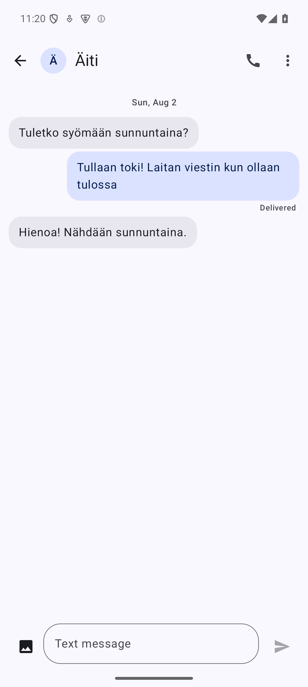

<p align="center">
  
</p>

<h1 align="center">ARK-phone</h1>

<p align="center">
  <a href="https://github.com/jrs8205/ARK-phone/releases/latest"></a>
  <a href="https://github.com/jrs8205/ARK-phone/releases"></a>
  <a href="LICENSE"></a>
</p>

<p align="center">
<strong>Free, encrypted internet calls between friends — inside a complete
replacement for your phone's Phone and Messages apps.</strong><br>
Android · Kotlin · Jetpack Compose · Material 3 · no ads, no tracking
</p>

## ARK calls: free, encrypted, phone to phone

ARK-phone is an alternative to WhatsApp, Signal, Telegram, Viber and other
VoIP apps for voice calls: calling is completely free, there is no account
and no phone-number registration, and the calls are placed from the phone app
you already use — not from a separate messenger.

1. **Create your ARK code** in Settings and share it with the people you call.
2. **Link a friend's code** on their contact card.
3. **Call as usual.** When the other phone is reachable the call goes over the
   internet, free of charge; when it is not, the same call goes over your
   carrier — a call always goes through.

- End-to-end encrypted audio (WebRTC with DTLS-SRTP) that travels phone to
  phone; a relay steps in only when no direct path exists, and it cannot
  decrypt anything
- Rings on a locked, sleeping phone, on Wi-Fi and on mobile data
- Nothing to sign up for: no phone number, e-mail or account — just a code
- Your settings, code and links can be saved to a backup file and moved to a
  new phone

Step-by-step instructions are in the [user guide](docs/USAGE.md#ark-internet-calls).

## A complete phone and messaging app

### Calls

- Full in-call screen: mute, speaker, hold, keypad; the screen turns off
  against your cheek
- Keypad with T9 search, speed dial and clipboard paste
- Recent calls with search, filters (missed, outgoing, blocked, WhatsApp) and
  grouping of repeated calls; WhatsApp calls in the history with a direct
  WhatsApp callback
- Contacts with favorites, most-called, search and a full contact card
- Spoken caller announcement and caller photo, also on the lock screen
- Dual SIM: default SIM for calls, SIM shown per call, SIM info page

### Call blocking

- Block single numbers, hidden numbers, callers not in your contacts, number
  prefixes, everything at set times, or per SIM
- Allow list, favorites and repeat callers get through
- Blocked calls are rejected or sent silently to voicemail, and listed in the
  history as blocked

### Messages

- Default SMS app: SMS and picture messages (MMS), including groups
- Search, unread indicators, delivery status, tappable links and numbers
- Notifications with quick reply and mark-as-read; blocked senders stay silent
- Multi-select delete and share; share text and pictures from other apps
  straight into ARK-phone

## Screenshots

| Home | Keypad | Messages | Conversation |
|---|---|---|---|
|  |  |  |  |

## Privacy

- No analytics, no crash reporting, no ads, no third-party SDKs that phone home
- Calls, messages and contacts stay in Android's own system stores
- Until you create an ARK code, the app makes no network connection at all
- With ARK calls on, a small signaling server (a Cloudflare Worker run by the
  author) stores your nickname, ARK code, public key and push token, sees your
  IP address while the app is connected, forwards call-setup messages and
  never carries audio
- A locked phone is woken for an incoming ARK call through Firebase Cloud
  Messaging; that push carries only the caller's ARK code
- The server address is in the source, so you can run your own

## Install

1. Download `ARK-phone-<version>-release.apk` from the
   [latest release](https://github.com/jrs8205/ARK-phone/releases/latest).
2. Open the file on your phone and allow installing from unknown sources
   when asked.
3. Set ARK-phone as the default phone app, and optionally as the default SMS
   app, when the app offers it.

Requires Android 8.0 (API 26) or newer. Tested on Pixel and Samsung Galaxy
phones. Everything else — ARK calls, blocking rules, backups, troubleshooting
— is in the [user guide](docs/USAGE.md).

## Development

```
./gradlew :app:assembleDebug
./gradlew :app:testDebugUnitTest :app:lintDebug
```

The debug APK is written to `app/build/outputs/apk/debug/`. ARK calls work
out of the box; a Firebase `app/google-services.json` is optional and only
adds the push wake-up for locked phones. To point the app at your own
signaling server, set `arkphone.voip.workerUrl` in `local.properties`. The
suite has 1 000+ unit tests and lint runs with `warningsAsErrors`.

## Languages

English, Finnish, Swedish, German, French, Spanish, Estonian, Russian,
Portuguese, Italian and Polish. The app follows the device language and falls
back to English; Android 13 and newer can pick a language per app.

## License

GPL-3.0 — see [LICENSE](LICENSE). The author's other public apps are listed
at [jrs8205.com](https://jrs8205.com).
